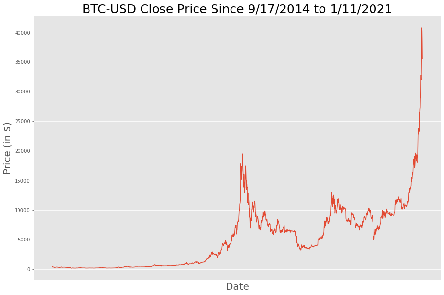
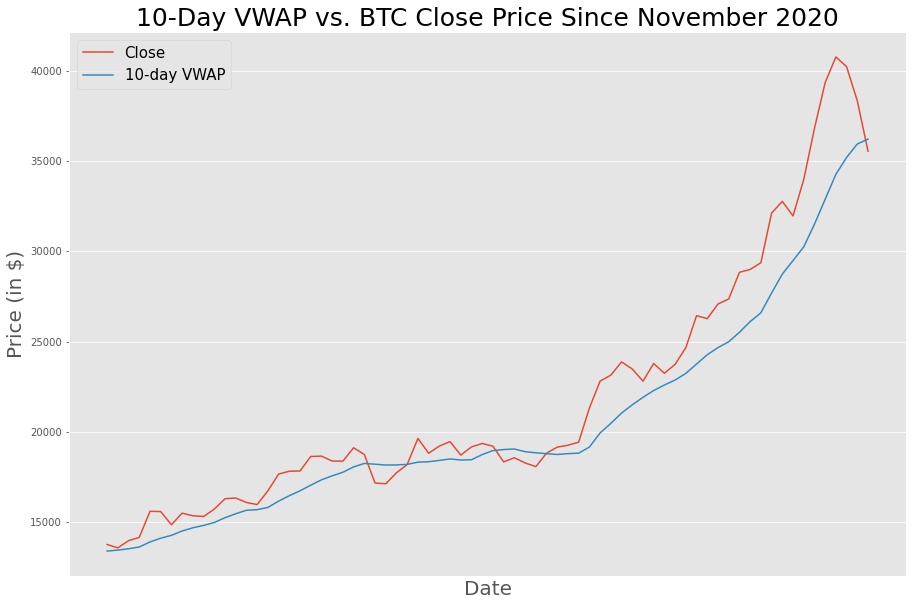
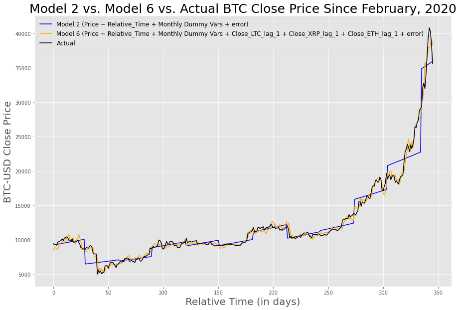
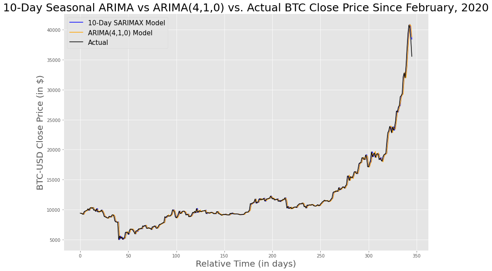

# Predicting Bitcoin Daily Price

This project focuses on the following: Can Bitcoin's (BTC) price be predicted with a time series model within a reasonable accuracy? By utilizing datasets from Yahoo! Finance, i.e. BTC-USD, BCH-USD, BNB-USD, BSV-USD, EOS-USD, ETH-USD, LTC-USD, XRP-USD, and XTZ-USD, models were built and compared via RMSE, i.e. multiple linear regression and ARIMA. Using other top cryptocurrencies in terms of market cap strengthened the multiple linear regression modeling of Bitcoin's price and were used as long as they were statistically significant, i.e. their t-stat p-values were less than an alpha of 0.05. Multicollinearity, or VIF score > 5, was ignored since the goal of time series was to obtain as accurate of a prediction as possible without emphasis on the meaning of the individual independent variables.  

## Exploring The Data

The Yahoo! Finance datasets, specifically BTC-USD, BCH-USD, BNB-USD, BSV-USD, EOS-USD, ETH-USD, LTC-USD, XRP-USD, and XTZ-USD, consisted of 2,310 rows, 1,270 rows, 1,268 rows, 251 rows, 1,292 rows, 1,986 rows, 2,310 rows, 2,310 rows, and 251 rows of data respectively, for a total of 13,248 rows of data. Each had the same column names/values of 'Date', 'Open, 'High', 'Low', 'Close', 'Adj Close', and 'Volume.' Each of the models built used the dependent variable of 'Close' since the main focus from a Finance perspective is to predict this when dealing with daily valuation data. The final date of the data used was 12JAN21.

The datasets can be found [here] via applicable searches (https://finance.yahoo.com/).

The line chart below shows the progression of Bitcoin's 'Close' Price over time since inception in the cryptocurrency market. Near the end of 2018, Bitcoin's price crashed, and there is quite the speculation that Bitcoin may experience another similar plunge in the near future following its' exponentially increasing price/bullish trend since March, 2020. A drastic negative market correction could potentially drive the price to plunge due to the domino effect of investors selling off their Bitcoin!  

Other prominent financial indicators in making informed trades include the use of VWAP vs. Price, MACD line vs. Signal line, and RSI. Below are line charts displaying 10-day VWAP vs. BTC-USD 'Close' Price, MACD line vs. Signal line, and Biweekly RSI. When VWAP lies above actual price, this is an indicator to sell or wait to buy, whereas when VWAP lies below, this is an indicator to buy or wait to sell. Cross-overs between VWAP and actual price are the optimal time to make these decisions, whether crossing above or below. When MACD crosses above the Signal line, this is an indicator to buy, whereas vice versa an indicator to sell. Moreover, the thresholds of 70 and 30 for RSI are generally used to indicate when a cryptocurrency is overbought or oversold, indicating times to sell or buy respectively.   

As for the histogramic distribution of Bitcoin's losses and gains over time, the majority of the occurrences lie in the 0 to -1% bin, indicating the majority of daily returns is a loss ranging from 0 to 1%. See below. 

## Modeling

As for modeling Bitcoin's 'Close' Price, the first model incorporated ln(Close) ~ Relative_Time, i.e. with day 0 at 01FEB20 and day 346 at 12JAN21, a total of 347 days. This served as more of start point since with time series, autoregression is a typical issue to have to deal with, as was the case with this initial model. The second model incorporated seasonality on a monthly time scale, with each month being statistically significant in describing the variation of BTC-USD's 'Close' Price, i.e. ln(Close) ~ Relative_Time + monthly dummy variables. Some outlier residuals distorted the evenness of the overall distribution of the residuals, but the residuals were overall random and normal. To incorporate additional top cryptocurrency prices into the second model to increase its' predictive power, their time-lagged (by 1 day) correlations with BTC-USD were visualized in a correlation plot as seen below. Time lag was applied in order to be able to predict the following day's BTC-USD 'Close' price. In order of highest to lowest significant correlation on this specific time scale from 01FEB20, i.e. ETH-USD, LTC-USD, BNB-USD, BCH-USD, and XRP-USD, all were included until arriving at a model with only statistically significant independent variables: Close ~ Relative_Time + Feb + Jun + Aug + Sep + Oct + Nov + Jan + Close_LTC_lag_1 + Close_XRP_lag_1 + Close_ETH_lag_1. To have a baseline model for comparison purposes, a 3-day MA time series model was calculated; this baseline model's RMSE was greater than this third model, i.e. ~787.15 vs. ~614.26, therefore this model was an improvement upon the baseline model. For a comparison of these models against actual price, see below. 

The best and final model was an ARIMA model of order = (1,1,1), or p=1, d=1, and q=1. This was found by executing a grid search among potential seasonality through the pmdarima Python library ranging from 1 to 30 days, or data points, per cycle. This type of model had the highest log likelihood score among all other models calculated by the function. The "weekly" seasonal model with the lowest AIC, i.e. SARIMAX(order = (1,1,1), seasonal_order = (1,0,[],7)), didn't have a lower RMSE, but was the second best model. Prediction of tomorrow's close price will be done when such data becomes available later, and this will be compared in terms of percent error relative to actual price. LSTM time-series modeling was attempted, however more granular data is needed for this model to be effectively reached, executable, and accurate.

## Next Steps

- Find more granular cryptocurrency data, i.e. of BTC-USD.
- With more granular data, complete LSTM modeling of BTC-USD and tune/re-adjust to get better MSE score than the best ARIMA model.
- Model other cryptocurrencies through similar pipeline to construct cryptocurrency investment portfolio based on predictions.
- Incorporate algorithmic trading advice via Python based on predictions and financial indicators' results.
- Inclusion of other factors into models, e.g. macroeconomic factors such as exchange rate of USD (DXY index), GDP, unemployment rate, and overall progression of the United States' debt, as well as results of sentiment analysis of the respective cryptocurrencies on popular cryptocurrency websites.  

## Main Python Libraries

- pandas
- numpy
- matplotlib
- statsmodels
  - ols
  - anova_lm
  - gofplots
  - ARIMA
  - SARIMAX
- tensorflow
  - keras
- seaborn
- bioinfokit
- scipy
  - stats
  - inv_boxcox
- math

## Code Files

- Plot_Series_Difference.py : contains function that plots a series of data and its' first difference separately
- LSTM_Windowize.py : contains function to "time" windowize data in preparation for LSTM/RNN modeling
- Coinbase_Data.py : contains function to pull Coinbase data for desired/inputted cryptocurrency 
- Predicting_Bitcoin_Price.ipynb : code to explore data, generate models, and produce results of those models
